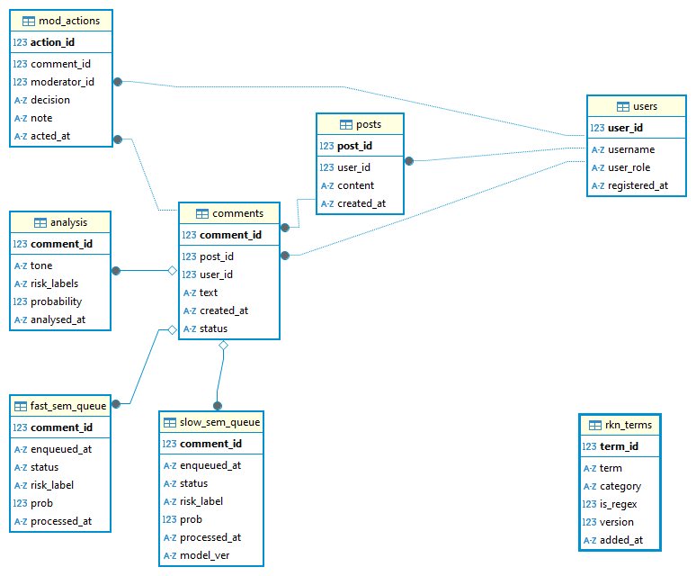
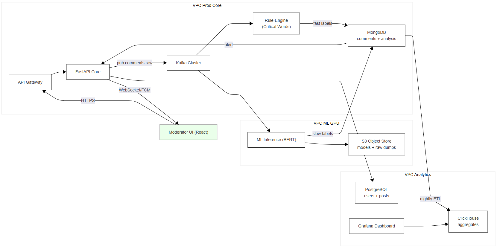
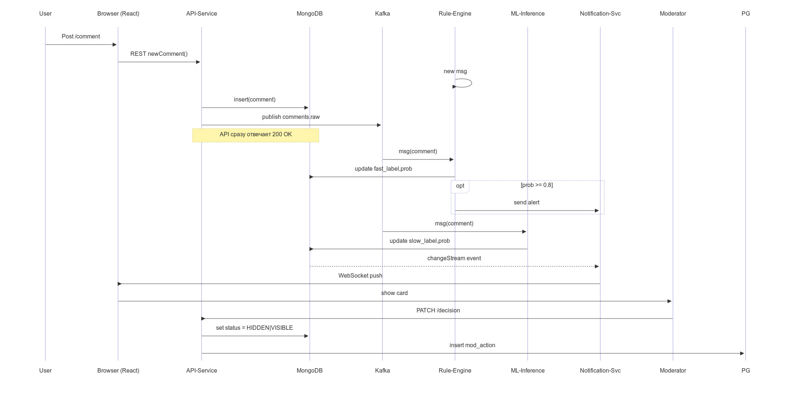

## Диаграммы

**Бизнес-процессы (BPMN)**

Текущий процесс

{ width=100% }

Целевое состоянеи процесса

{ width=100% }

Диаграмма структуры данных

Диаграмма архитектуры системы

Структурная UML 

Поведенческая UML

