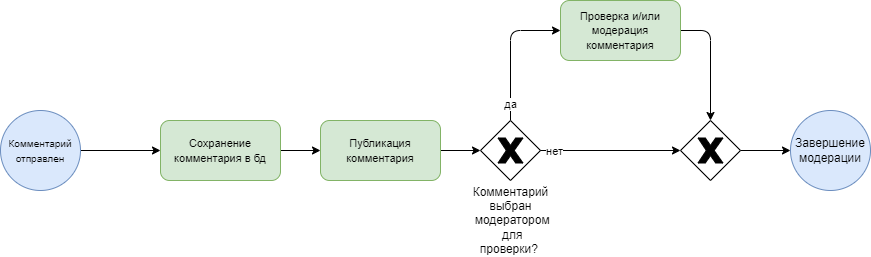
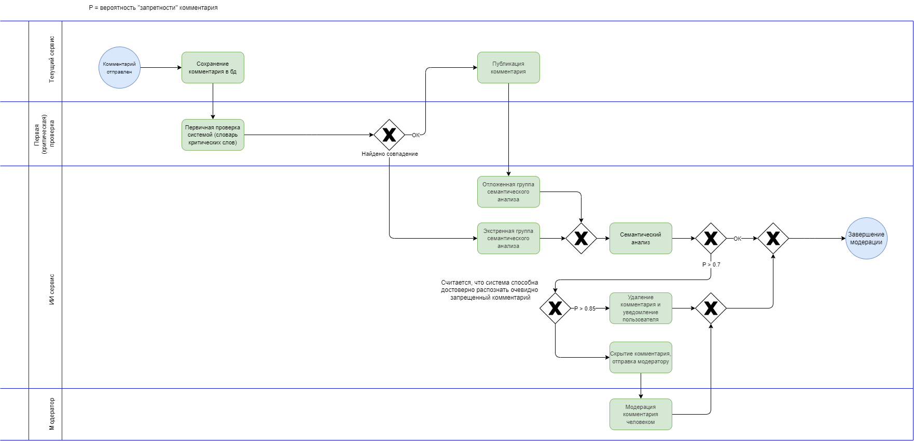
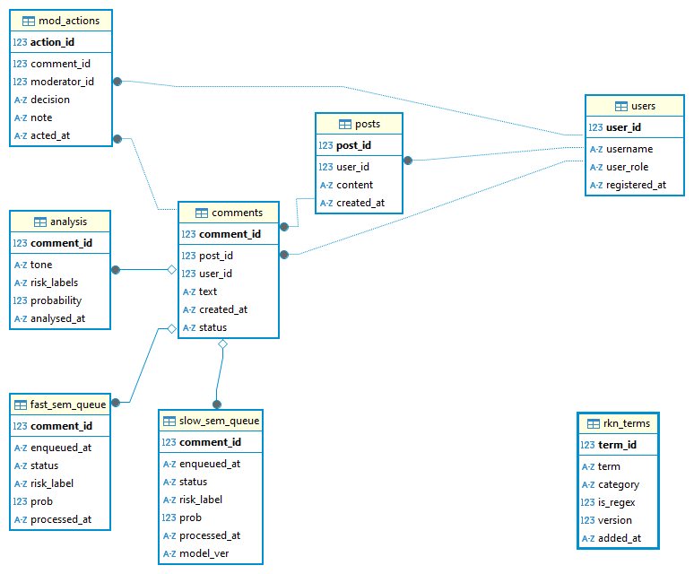
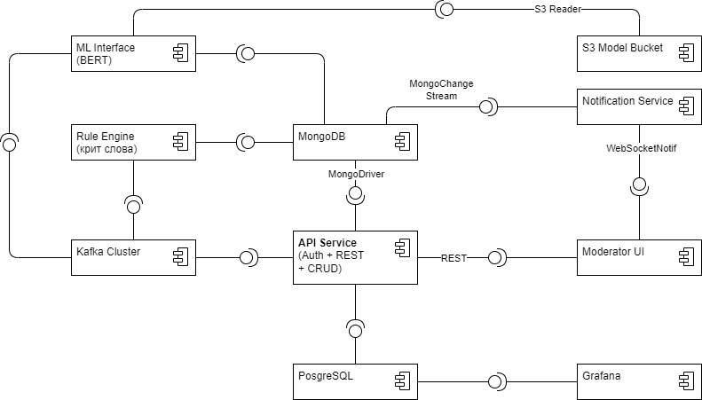
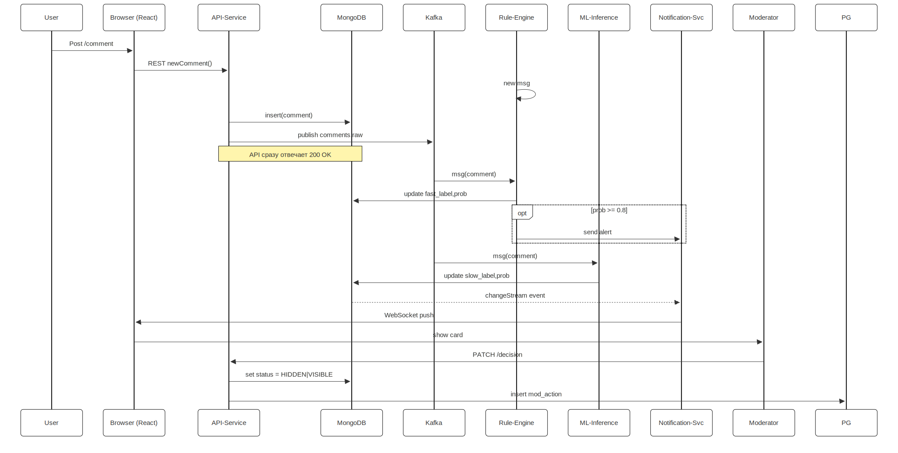

## Общая информация

*Информационная система мониторинга пользовательских реакций на контент в соцсети с применением ИИ*

***Команда проекта***

- Участник 1 — Data Scientist;
- Участник 2 — Data Engineer, Data Architect;
- Участник 3 — Software Architect.

### Бизнес-цель проекта
Автоматизировать мониторинг пользовательских реакций на контент (посты, рекламу, новости) в социальной сети, чтобы оперативно выявлять негативные комментарии, улучшать модерацию и повышать вовлеченность аудитории

**Описание текущего процесса**

- Модерация осуществляется вручную: модераторы читают выборочные комментарии;
- Медленный и субъективный процесс;
- Ежедневно обрабатывается до 500,000 комментариев, модерация не масштабируется эффективно.

**Целевое состояние процесса**

- Автоматическое выявление тональности комментариев (негатив, позитив, нейтральность);
- Оперативное уведомление модераторов о потенциально неприемлемых комментариях;
- Автоматическое формирование отчетности о реакции аудитории для стратегического анализа контента;
- Предварительная фильтрация комментариев по списку критических слов, потенциально неприемлемых согласно требованиям РКН (без семантического анализа).

## Цели и предпосылки

**Зачем идём в разработку продукта?**

- Ускорить и масштабировать процесс анализа комментариев;
- Минимизировать риски штрафов от РКН за распространение запрещённого контента;
- Повысить вовлеченность аудитории за счёт оперативного выявления и устранения негатива.

**Почему станет лучше от использования ML?**

- Быстрая и объективная обработка больших объёмов данных;
- Снижение затрат на ручной труд модераторов;
- Эффективное выявление запрещённых тем (терроризм, нацизм, наркотики и др.) через семантический анализ.

**Бизнес-требования и ограничения:**

- Оперативность и точность выявления запрещённых тем и негатива;
- Соблюдение требований законодательства (РКН);
- Защита персональных данных и конфиденциальность.

**Функциональные и нефункциональные требования:**

- Автоматическое выявление запрещённого контента и негатива;
- Оповещение модераторов;
- Скорость обработки данных, высокая доступность, отказоустойчивость;
- Распознавание обфускации.

**Подготовка пилота и критерии успеха:**

- Способ оценки: метрики precision и recall;
- Успешный пилот: точность выявления запрещённого контента выше 90%;
- Подготовка: выделение и разметка пилотной выборки данных.

**MVP и технический долг:**

- MVP включает основной алгоритм анализа и интерфейс модераторов;
- Масштабируемость и полная или частичная автоматизация отчётов.

## Диаграммы

**Бизнес-процессы (BPMN)**

Текущий процесс

Целевое состоянеи процесса

Диаграмма структуры данных

Диаграмма архитектуры системы

Структурная UML 

Поведенческая UML

